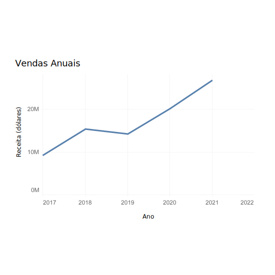
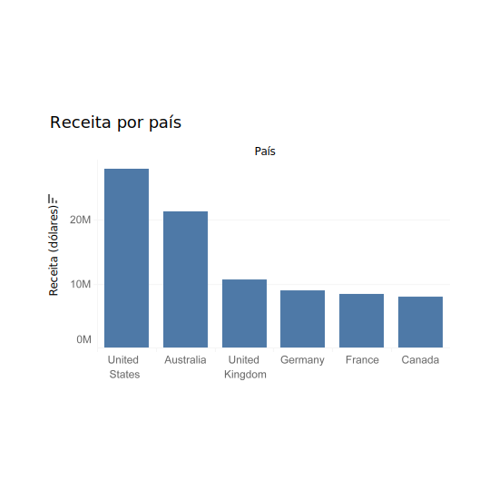
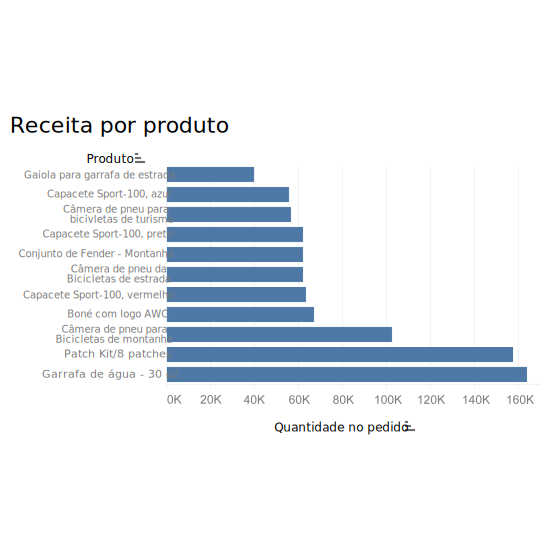
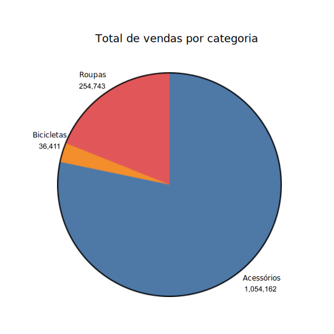
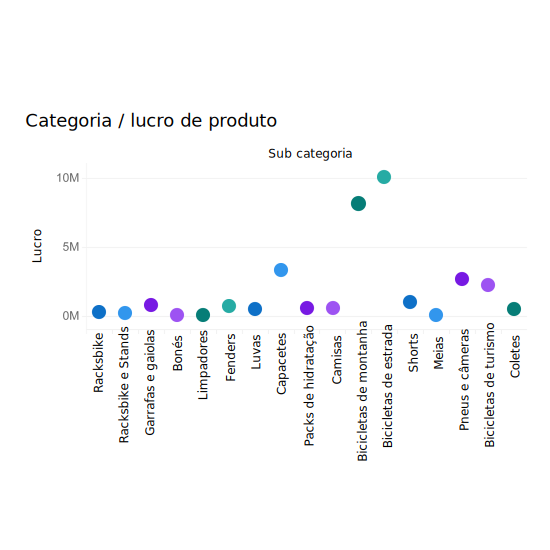

# O que são dados?

## Sumário:

1. [O que são dados e de onde eles vêm](#o-que-são-dados-e-de-onde-eles-vêm)
    1. [Dados Voluntários](#dados-voluntários)
    2. [Dados Observadores](#dados-observados)
    3. [Dados Inferidos](#dados-inferidos)
2. [Uso de dados na vida diária](#uso-de-dados-na-vida-diária)
    1. [Informações para tomadas de decisão](#informações-para-tomadas-de-decisão)
    2. [Identificação das melhorias nos processos e produtos](#identificação-das-melhorias-nos-processos-e-produtos)
    3. [Rastreamento e previsão de eventos](#rastreamento-e-previsão-de-eventos)
    4. [Permitir maior visibilidade dos comportamentos](#permitir-maior-visibilidade-dos-comportamentos)
3. [A importância da Visualização](#a-importância-da-visualização)
4. [Maneiras de visualizar os Dados](#maneiras-de-visualizar-os-dados)
    1. [Gráficos de Linhas](#gŕaficos-de-linhas)
    2. [Gráfico de Coluna](#gráficos-de-coluna)
    3. [Gráfico de Barras](#gráficos-de-barras)
    4. [Gráfico de Pizza](#gráficos-de-pizza)
    5. [Gráfico de Dispersão](#gráfico-de-dispersão)

## O que são dados e de onde eles vêm?

- Existe três tipos de grandes quantidades de dados:
    - Dados Voluntários
    - Dados Observados
    - Dados Inferidos

### Dados Voluntários:

O usuário disponibiliza dados preenchendo formulários, postando fotos e vídeos nas redes sociais, ou consentindo com a política do sites do site.

**Exemplo:** Sua equipe está desenvolvendo um chatbot para coletar informações de clientes, como a probabilidade de fazer uma compra, preferências de produto e outras informações que você não pode obter em outro lugar. Esses dados **voluntários** podem ser usados para melhorar consideravelmente a experiência e a satisfação do cliente, oferecendo a ele os melhores produtos de acordo com as preferências pessoais.

### Dados Observados:

As empresas também pegam dados dos usuários por meio de localização, lojas que o usuário frequenta e sistes que visita. Seu estilo pessoa, gostos e desgostos.

**Exemplo:** A Data Crunchers está assumindo um projeto para desenvolver um modelo para um varejista de calçados esportivos que prevê quais marcas os clientes provavelmente comprarão, para que os esforços de marketing possam atingir o cliente certo com o calçado certo. Para obter a melhor previsibilidade, você deve usar dados **observados** no modelo, pois eles foram coletados de usuários que estão comprando tênis.

### Dados Inferidos:

O estilo pessoal, gostos e desgotos, e hábitos comportamentais dos usuários podem ser considerados como inferidos também

**Exemplo:** Ao se preparar para as férias, você passa muito tempo pesquisando seus planos de viagem em blogs e mecanismos de pesquisa. Mais tarde, você começa a receber anúncios de produtos e serviços de viagem. Você foi direcionado para esses anúncios devido aos dados **inferidos** coletados de seus históricos de pesquisa, consumo de conteúdo e atividade em mídiaa social.

## Uso de dados na vida diária

- Entre os usos de dados em nosso dia-a-dia, estão as:
    - Informações para tomadas de decisão
    - Identificação das melhorias nos processos e produtos
    - Rastreamento e previsão de eventos
    - Permitir maior visibilidade dos comportamentos

### Informações para tomadas de decisão:

Desde recomendações de produtos que vemos, em sites de compras até estatísticas de desempenho de atletas e quais mantimentos estocar no mercado, nossas decisões são influenciadas pelos reusltados da ciência de dados e da IA.

### Identificação das melhorias nos processos e produtos:

Através da capacidade de utilizar dados coletados a partir de análises e classificações de produtos, os fabricantes podem modificar designs ou alterar os seus processos para produzir e oferecer melhores produtos aos seus consumidores.

### Rastreamento e previsão de eventos:

Um dos maiorias benefícios que podemos obter com a análise é a capacidade de rastrear, isolar e até mesmo prever eventos. Um engenheiro de rede pode usar um painel para isolar áreas de lentidão e reagir imediatamente para garantir que não cause problemas para os usuários. Ou os analistas climáticos podem prever com precisão os impactos do clima em todos os aspectos de nossas economias. Carros automáticos podem reconhecer possíveis acidentes e tomar medidas para evitar acidentes. 

### Permitir maior visibilidade dos comportamentos:

AS organizações agora tem maior visibilidade sobre como seus produtos são usados, os padrões de compra dos seus clientes, e as informaçoes logísticas  para gerenciar seus prazos de entrega.

## A importância da Visualização

Existem muitos tipos de gráficos usados para apresentar informações graficamente.É fundamental garantir que o tipo de visualização usado ilustre melhor o padrão, o problema ou a tendência que precisa ser destacado; nem todos os tipos de visualizações são apropriados para todos os tipos de dados.  

- Fatores a serem considerados ao escolher uma visualização:

- O número de variáveis, que são as características medidas, que precisam ser mostradas

- O número de pontos de dados, ou unidades de informação, em cada variável

- Se os dados ilustram as mudanças ao longo do tempo (de hora em hora, diariamente, semanalmente)

- A necessidade de fazer uma comparação ou correlação entre diferentes pontos de dados

## Maneiras de visualizar os Dados

O tipo correto de visualização de dados pode apresentar intuitivamente dados complexos. Selecione cada tipo de visualização de dados para ver seus casos de uso típicos e práticas recomendadas. 

**Observação:** para saber mais sobre outros tipos de gráficos, pesquise na Internet: escolha o tipo de gráfico certo para seus dados no tableau.

### Gŕaficos de linhas:

**Gráficos de linhas** são um dos tipos mais comumente utilizados para comparar dois conjuntos de dados. Utilize gráficos de linhas quando o número de pontos de dados for elevado e quando você desejar mostrar uma tendência nos dados ao longo do tempo.

Casos de uso para gráficos de linhas:

- As vendas trimestrais de uma empresa nos últimos cinco anos. 

- O número de clientes por semana no primeiro ano de uma nova loja de varejo.

- Mudanças no preço de uma ação desde a abertura até o fechamento. 

Práticas recomendadas para gráficos de linhas:

- Rotule os eixos e as linhas de referência usadas para medir as coordenadas do gráfico. É comum traçar o tempo no eixo x (horizontal) e os valores de dados no eixo y (vertical).  

- Use uma linhas contínua para conectar os pontos de dados para ilustrar as tendências. 

- Mantenha mínimo o número de linhas plotadas, normalmente não mais de 5, para que o gráfico não fique confuso e difícil de ler. 

- Adicione uma legenda, uma pequena representação visual dos dados do gráfico, que informa o que cada linhas representa para ajudar o público a entender o que está visualizando. 

- Sempre adicione um título.

### Gráficos de Coluna:

**Os gráficos de colunas** são posicionados verticalmente, conforme mostrado na figura. Provavelmente, são o tipo de gráfico mais comumente usado para exibir o valor numérico de um ponto de dados específico e comparar esse valor entre categorias semelhantes. Eles permitem a fácil comparação entre vários pontos de dados.

Casos de uso para gráficos de colunas:

- Receita por país, conforme mostrado no exemplo de gráfico. 

- Vendas do ano passado para as quatro principais empresas automobilísticas nos Estados Unidos. 

- Pontuações médias dos testes dos alunos para cada uma das seis aulas de matemática. 

Práticas recomendadas para gráficos de colunas:

- Rotule os eixos. 

- Se o gráfico mostrar alterações ao longo do tempo, trace os incrementos de tempo no eixo x. 

- Se o tempo não fizer parte dos dados, considere ordenar as alturas das colunas em ordem crescente ou decrescente para demonstrar mudanças ou tendências.  

- Mantenha o número de colunas baixo, normalmente não mais de 7, para que o visualizador possa ver o valor de cada coluna.  

- Inicie o valor do eixo y em zero para refletir com precisão o valor total da coluna. 

- O espaçamento entre as colunas deve ser aproximadamente metade da largura de uma coluna.

### Gráficos de Barras:

**Os gráficos de barras** são semelhantes aos gráficos de colunas, exceto que os dados são exibidos horizontalmente. Os gráficos de barras também permitem uma comparação fácil entre vários pontos de dados. Os rótulos dos pontos de dados no gráfico de barras horizontais estão no lado esquerdo e são mais legíveis quando o rótulo contém texto em vez de valores.

Casos de uso para gráficos de barras:

- Produto interno bruto (PIB) das 25 nações com maior faturamento. 

- O número de carros em uma concessionária vendidos por cada representante de vendas.

- As pontuações na prova para cada aluno em uma turma de matemática. 

Melhores práticas para gráficos de barras:

- Rotule os eixos. 

- Considere ordenar as barras de modo que os comprimentos vão do maior para o menor. O tipo de dados provavelmente determinará se a barra mais longa deve estar na parte inferior ou superior para melhor ilustrar o padrão ou tendência pretendida.

- Inicie o valor do eixo x em zero para refletir com precisão o valor total das barras.

- O espaçamento entre as barras deve ser aproximadamente metade da largura de uma barra.

### Gráficos de Pizza:

**Os gráficos de pizza** mostram partes de um todo. Cada fatia, ou segmento, da “torta” representa uma porcentagem do número total. A soma total dos segmentos deve ser igual a 100%. Um gráfico de pizza exibe os diferentes valores de uma determinada variável. Alguns casos de uso que ilustram a comparação das informações com um gráfico de pizza incluem:

- Categorias de despesas anuais para uma empresa (por exemplo, aluguel, administrativo, serviços públicos, produção)

- As fontes de energia de um país (por exemplo, petróleo, carvão, gás, solar, eólica)

- Resultados de pesquisa para tipo de filme favorito (por exemplo, ação, romance, comédia, drama, ficção científica)

Algumas práticas recomendadas para gráficos de pizza incluem:

- Mantenha o número de categorias mínimo para que o espectador possa diferenciar entre os segmentos. Depois de dez segmentos, as fatias começam a perder significado e impacto. Se necessário, consolide segmentos menores em um segmento com um rótulo como "Outros" ou "Diversos". 

- Utilize uma cor diferente ou tons de escala de cinza para cada segmento. 

- Ordene os segmentos de acordo com o tamanho. 

- Certifique-se de que o valor de todos os segmentos somados seja igual a 100%.

### Gráfico de dispersão:

**Os gráficos de dispersão** são muito populares para visualizações de correlação ou quando você deseja mostrar a distribuição, ou todos os valores possíveis, de um grande número de pontos de dados. Os gráficos de dispersão também são úteis para demonstrar o agrupamento ou identificar valores discrepantes nos dados. Alguns casos de uso que ilustram a visualização da distribuição de muitos pontos de dados com um gráfico de dispersão incluem:

- Comparação das expectativas de vida dos países com seus PIBs (Produto Interno Bruto).

- Comparação das vendas diárias de sorvete com a temperatura externa média em vários dias.

- Comparação do peso com a altura de cada pessoa em um grupo grande. 

Algumas práticas recomendadas para gráficos de dispersão incluem:

- Rotular os eixos. 

- Certifique-se de que o conjunto de dados seja grande o suficiente para fornecer visualização de agrupamentos ou valores atípicos. 

- Inicie o valor do eixo y em zero para representar os dados com precisão. O valor do eixo x dependerá dos dados. Por exemplo, as faixas etárias podem ser rotuladas no eixo x. 

- Considere adicionar uma linhas de tendência se um gráfico de dispersão mostrar uma correlação entre os eixos x e y.

- Não use mais de duas linhas de tendência. 