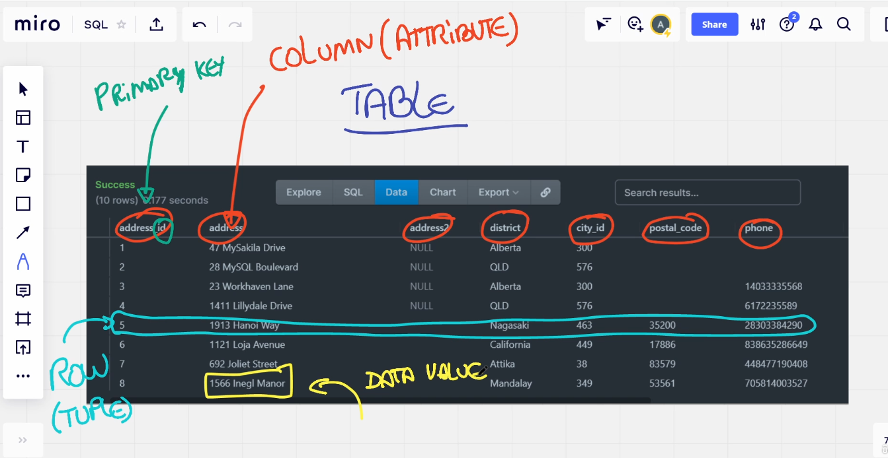
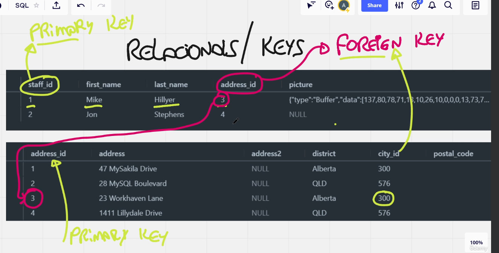

# O que são Banco de Dados

É aonde você armazena suas informações.

# Diferença entre SQL e NoSQL

## SQL

- É uma linguagem para banco de dados relacionais
- Funciona com tabelas
- Cada tabela tem um número identificador, um ID
- Quanto maior a tabela, mais lenta serão as requisições e as atividades que pode ser executado

## NoSQL

- É uma linguagem para banco de dados não relacionais
- Armazena informação em documentos diferentes
- Tem mais velocidade e dá para armazenar um grande quantidade de dados que não conseguiria numa SQL

# O que é uma DBMS

- Sistema de Gerenciamento de BDs
    - Exemplo: MySQL, Oracle, Microsoft Access, PostgreSQL, MariaDB, Microsoft SQL Server
- É o software que vai organizar e armazenar e fazer mais funções como backups, import/export, prog. lang

# Tabelas

- Bancos de dados relacionais trabalham com tabelas
- Tabelas são um conjunto de várias colunas (atributos)
- Data Value: Um dado que está dentro de uma célula

# Tabelas Relacionais / Keys

- As tabelas tem uma relação entre elas

- FOREIGN KEY (Chave importada de outra tabela)
- Grande quantidade de Chaves é para evitar duplicação de dados.
    - Redução do BD