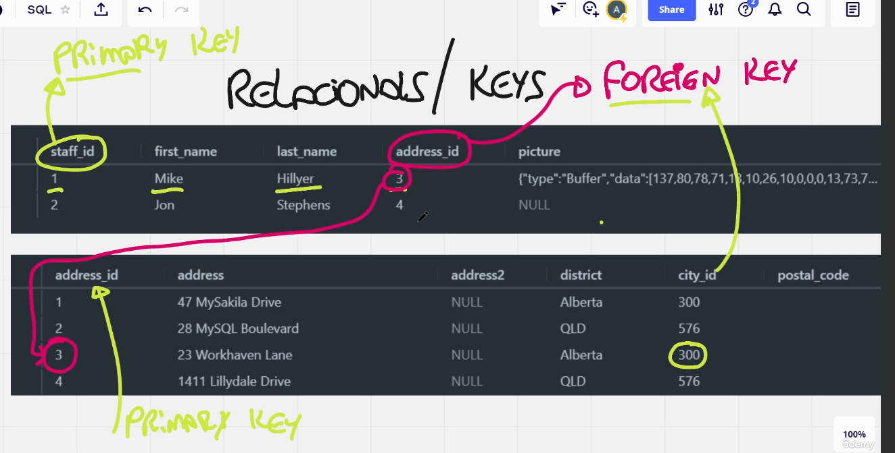

# SQL

## Sumário

1. [Tabelas](#tabelas)
    - 1.2 [Tabelas Relacionais/Keys](#tabelas-relacionaiskeys)
2. [Utilizando o USE e SELECT](#utilizando-o-use-e-select)


## Tabelas

- Bancos de dados relacionais trabalham com tabelas
- Tabelas são um conjunto de várias colunas (atributos)
- Data Value: Um dado que está dentro de uma célula


### Tabelas Relacionais/Keys

- As tabelas tem uma relação entre elas



- FOREIGN KEY (Chave importada de outra tabela)
- Grande quantidade de Chaves é para evitar duplicação de dados.
    - Redução do BD

## Utilizando o USE e SELECT

- O **USE** ele seleciona um BD (um esquema)
- O **SELECT** seleciona a coluna
- o **FROM** é uma forma de indicar "de onde"

**Exemplo 1:**

```sql
SELECT actor_id,first_name FROM actor
```

- Nesse exemplo acima ele pega a coluna actor_id e first_name da tabela actor

**Exemplo 2:**

```sql
SELECT * FROM actor
```

- O **"*"** lista todas ao mesmo tempo.

## Ordenando com o ORDER BY

- O **ORDER BY** é para ordenar a coluna

**Exemplo 1:**

```sql
ORDER BY first_name
```

- Vai ordenar em ordem alfabética pela coluna first_name

## Adicionando o WHERE e comentando uma linha

- O **WHERE** consegue filtrar qualquer linha dentro de uma coluna

**Exemplo 1:**

```sql
WHERE actor_id = 100
```

- Vai puxar a linha 100 a partir do actor_id

**Exemplo 2:**

```sql
WHERE actor_id <= 10
```

- Vai puxar até a linha 10

**Comentando uma linha**

```sql
-- ORDER BY last_name
```

- Para comentar uma linha é só usaar o **"--"**

## Modificando coluna

```sql
USE sakila

SELECT
    customer_id,
    amount,
    amount - amount * 0.10 AS '10% discount'
FROM payment
WHERE custumer_id = 1
 ```

 - Praticamente nesse exercício ele quer criar uma nova coluna onde mostra os valores com 10% de desocntro, para isso ele adicionou no **SELECT** o `amount - amount * 0.10` e utilizou o **AS** `AS '10% discount'` para a coluna ter o nome "10% discount".

 ## Mais variações do WHERE

 ```sql
asc -- De baixo para cima
desc -- De cima para baixo

ORDER BY amount desc
 ```

 - Aqui ele está pegando a coluna amount e mostrand ode cima para baixo

## Operadores AND, OR e NOT

```sql
SELECT * FROM customer
WHERE store_id = 1 AND active = 0
```

```sql
SELECT * FROM payment
WHERE store_id = 1 OR amount = 0.99
```

```sql
SELECT * FROM payment
WHERE NOT store_id = 1 AND amount != 0.99 AND customer_id < 10
```

## Operador IN

```sql
SELECT * FROM address
WHERE district IN ('Alberta', 'Texas', 'California')
```

## Operador BETWEEN

```sql
SELECT * FROM payment
WHERE amount BETWEEN 1.99 and 3.99
```

- Utilizar para puxar uma range entre início e fim

## Operador LIKE

```sql
SELECT * FROM actor
WHERE first_name LIKE 'A%'
-- WHERE first_name LIKE '%o'
```

- Vai pegar todos os primeiros nomes de atores que se inicia com a letra "A"
- O comentário é quando alguma finaliza com a letra "o".

## Leitura Complementar - Like

A expressão `LIKE` em SQL é usada para verificar se uma cadeia de caracteres corresponde a um padrão específico. O operador `LIKE` retorna verdadeiro se a cadeia de caracteres está no conjunto definido pelo padrão; já NOT `LIKE` retorna o contrário.

**Regras Básicas:**

- **Caracteres Especiais:**
    - **_ (sublinhado)**: corresponde a qualquer caractere único.
    - **% (percentagem)**: corresponde a qualquer sequência de caracteres, inclusive nenhuma.
- **Padrões Específicos:**
    - Sem **%** ou **_**, **LIKE** age como uma comparação de igualdade (**=**).
- **Posição no Texto:**
    - Para encontrar o padrão em qualquer parte da cadeia, use % no início e no fim do padrão.

**Caracteres de Escape:**

- Para buscar os caracteres `_` ou `%` literalmente, é necessário usar um caractere de escape, geralmente a contrabarra (`\`). No entanto, contrabarras exigem atenção extra em literais de texto, precisando ser duplicadas para serem interpretadas corretamente.
Assim, `LIKE` é um operador flexível para buscas parciais e correspondências de padrões em SQL, com recursos para tratar exceções e caracteres especiais.

## Operador IS NULL

- Ele vai analsiar qual campo está vazio

```sql
SELECT * FROM  address
WHERE address2 IS NULL
```

## Operador Limit

```sql
SELECT * FROM actor
LIMIT 5, 10
```

- O `LIMIT` ali está mostrando que vai pega as 10 primeiras só que a partir da linha 5 (é chamado de offset)

## Operador REGEXP

```sql
SELECT * FROM actor
WHERE first_name REGEXP 'a'
-- WHERE first_name REGEXP '^a'
-- WHERE first_name REGEXP 'a|d'
-- WHERE first_name REGEXP '^a|^d'
-- WHERE first_name REGEXP '[ge]a'
```

- O `REGEXP a` vai pegar todos os nomes que contém a letra "a"
- O `REGEXP ^a` vai pegar todos os nomes que começam com a letra a"
- O `REGEXP a|d` vai pegar todos os nomes que contém a letra "a" e "d"
- O `REGEXP a|d` vai pegar todos os nomes que iniciam com a letra "a" e "d"
- O `REGEXP [ge]a` vai pegar todos os nomes que começam com "ga" e "ea"